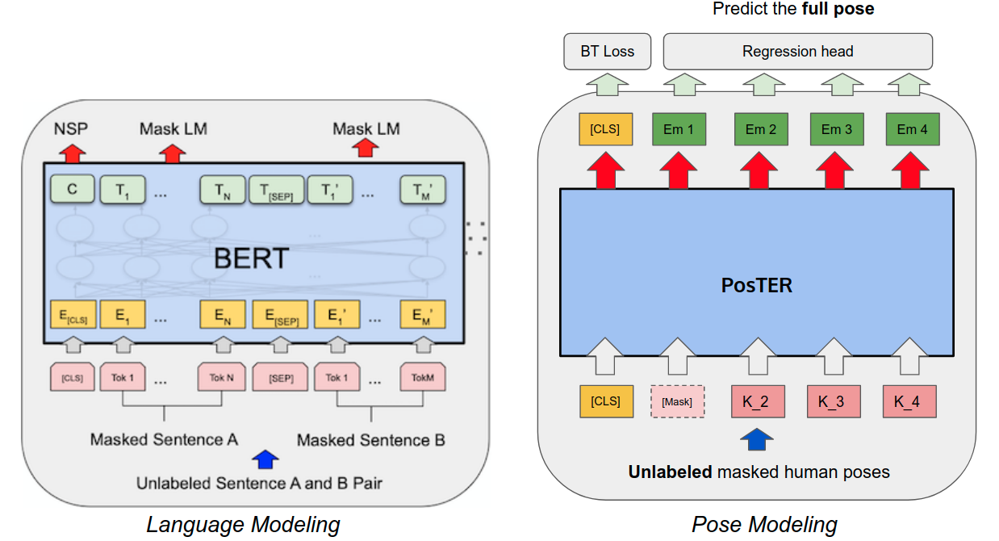

# PosTER

Implementation of PosTER - Pose Transformer Encoder Representation - for pedestrian attributes recognition. Object Recognition and Computer Vision course. ENS Paris Saclay 2021-2022



> We introduce in a transformer architecture pretrained in a self-supervised setting to generate meaningful and interpretable embeddings for poses. Those embeddings can then be used to make attribute prediction with a simple decoder reaching comparable results with models trained from scratch on some attributes.

- [PosTER](#poster)
  * [Requirements](#requirements)
  * [Get predictions](#get-predictions)
    + [Model zoo](#model-zoo)
  * [Tokenizing Poses](#tokenizing-poses)
  * [Augmenting Poses](#augmenting-poses)
  * [Pose modeling](#pose-modeling)
    + [Pose modeling on PIE dataset](#pose-modeling-on-pie-dataset)
    + [Running pose-modeling script](#running-pose-modeling-script)
      - [Wandb visualization (Recommended)](#wandb-visualization--recommended-)
  * [Fine-tuning on pedestrian attributes](#fine-tuning-on-pedestrian-attributes)


## Requirements

This repository requires mainly ```pytorch``` and ```wandb``` for visualization. We strongly recommend you to create an account on [wandb](https://wandb.ai/) for better visualization. For installing the libraries, run:

```
pip3 install -r requirements.txt
```

## Get predictions

### Model zoo

+ PosTER pre-trained on TITAN and fine-tuned on TITAN attributes: [here](https://drive.google.com/file/d/1-BhkcTJ7wXNwh1HX5bUGPeZVlWyJ626P/view?fbclid=IwAR2fLV4xLEHYfj0ia2gnJBUE84QFv1e50S3RM9o5iscnLqM4JLjixSuOaB0)
+ Other models coming soon..!

Once the model downloaded, put your input images (```png```or ```jpg```) into the ```input/``` directory and the pre-trained model that has to be renamed ```PosTER_FT.p``` into ```Models```. Then, run ```python3 predict.py```. The output image should be save at ```output/```


## Tokenizing Poses


We tokenize poses by individual body part. Therefore, a single pose containing 17 keypoints can be seen as a sequence of 17 token of dimension 3 in order to be fed to a Transformers based architecture.

## Augmenting Poses

We introduce in ```Poster/Datasets/augmentations.py``` augmentations that can be applied to 2d Human poses, such as flipping, random translation and normalization.

## Pose modeling 

### Pose modeling on PIE dataset

We extracted poses using OpenPifPaf on PIE dataset. The 2D poses files can be found on this [link](https://drive.google.com/file/d/195g6eDeAaLRt7nEN5EweB7-eWwbktkQ_/view?usp=sharing). You should download it and extract it.

### Running pose-modeling script

>**You have one config file to change and manipulate**.

Please carefully refer to our [training wiki](https://github.com/younesbelkada/PosTER/wiki/Training-wiki) in order to understand each argument of the config file ```config.json```. 

After modifying the config file, run ```python test.py```.

#### Wandb visualization (Recommended)

We highly recommend you to use wandb for visualzing intermediate results while training your model. You can easily create an account on [wandb](https://wandb.ai/younesbelkada/PosTER) and push the results using your credentials. Read our [training wiki](https://github.com/younesbelkada/PosTER/wiki/Training-wiki) to understand more.

## Fine-tuning on pedestrian attributes

This is possible on TITAN dataset only, in order to get the association between each pose on TITAN and its label, we have to run an off-the-shelf pose detector on TITAN, and match the predicted bounding boxes with the ground truth bounding boxes on TITAN dataset. An already processed dataset (*i.e,* a pickle file containing the poses with the labels) is available upon request. To measure the impact of our learned embeddings, we freeze all the layers of PosTER and predict the attributes using a small Fully Connected block on top of these embeddings.

Some quantitative comparison results on TITAN test set (merged classes) between MonoLoco (trained from scratch) and our method (with a pose-modeling pretraining on TITAN training set):

| Attribute Name  | F1-MonoLoco | F1-Ours |
| ------------- | ------------- | ------------- |
| Walking | 89.2 | **89.6** |
| Standing | **60.1** | **58.3** |
| Sitting | 62.8 | **67.4** |
| Bending | 55.7 | **57.8** |
| Biking | 79.8 | 80.0 |
| Mean-F1 | 69.5 | **70.6** |

You can also fine-tune on communicative attributes using our script (refer to our training wiki).
