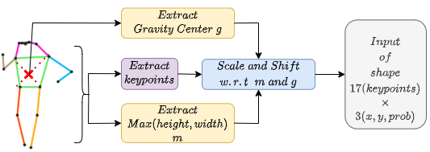

# PosTER

Implementation of PosTER - Pose Transformer Encoder Representation - for pedestrian attributes recognition. Object Recognition and Computer Vision course. ENS Paris Saclay 2021-2022


> We introduce in a transformer architecture pretrained in a self-supervised setting to generate meaningful and interpretable embeddings for poses. Those embeddings can then be used to make attribute prediction with a simple decoder reaching comparable results with models trained from scratch on some attributes.

## Requirements

This repository requires mainly ```pytorch``` and ```wandb``` for visualization. We strongly recommend you to create an account on [wandb](https://wandb.ai/) for better visualization. For installing the libraries, run:

```
pip3 install -r requirements.txt
```

## Tokenizing Poses



We tokenize poses by individual body part. Therefore, a single pose containing 17 keypoints can be seen as a sequence of 17 token of dimension 3 in order to be fed to a Transformers based architecture.

## Augmenting Poses

We introduce in ```Poster/Datasets/augmentations.py``` augmentations that can be applied to 2d Human poses, such as flipping, random translation and normalization.
